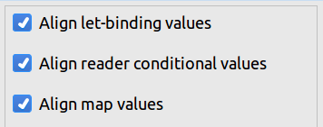

# Clojure code conventions and formatting guide (WIP)

## Function call nesting vs threading

Always prefer threading to nesting.

; bad

```Clojure
(filter identity (map even [1 2 3]))
```

; good

```Clojure
(->> [1 2 3]
     (map even)
     (filter identity))
```

## Naming

Always use full words instead of abbreviations.

; bad

    (fn [spc-key])

; good

    (fn [space-key])

## Destructuring

Always use destructuring where possible.

* Function arguments
* (let), (doseq), (for)
* etc..

## Avoid nesting threading forms

## Avoid using the #(%1) macro

## Avoid using (reduce) when possible

; bad

```Clojure
(reduce #(assoc %1 (:id %2) %2)
    {}
    pages)
```

; good

```Clojure
(->> pages
     (fn [{:keys [id] :as business-page}]
       [id business-page])
     (into {}))
```

## Vertical vs Horizontal indentation 

### Maps

Always indent maps vertically.

; bad

```Clojure
{:a 1 :b 2 :c 3}
```

; good

```Clojure
{:a 1
 :b 2
 :c 3}
```

### Nested maps

```Clojure
{:a {:b {:c 1
         :d 2}}}
```

### Functions

; bad

```Clojure
(fn [page] [(:id page) page])
```

; good

```Clojure
(fn [page] 
  [(:id page) page])
```

### (when)

; bad

```Clojure
(when (:show? @modal) [modal-panel @modal])
```

; good

```Clojure
 (when (:show? @modal) 
   [modal-panel @modal])
```

### (if)

; bad

```Clojure
(if true (println "true") (println "untrue"))
```

; good

```Clojure
(if true
  (println "true") 
  (println "untrue"))
```

#### Cursive users

Make sure that the following options are checked:



#### CIDER users

https://github.com/clojure-emacs/clojure-mode#vertical-alignment

#### Vim users

vim-easy-align may be used in blockwise visual mode to align maps:

https://github.com/junegunn/vim-easy-align/issues/115

### Vectors

Align horizontally, unless it becomes too long, then align vertically.

```Clojure
[1 2 3]
```

```Clojure
[1
 2
 3
 4
 5
 6
 7
 8
 9
 10]
```

## Trailing parens

; bad

```Clojure
{
:a 1
:b 2
}
 
(defn test [p]
  (let [a 1]
    (println a))
)
```

; good

```Clojure
{:a 1
 :b 2}
 
(defn test [p]
  (let [a 1]
    (println a)))
```
